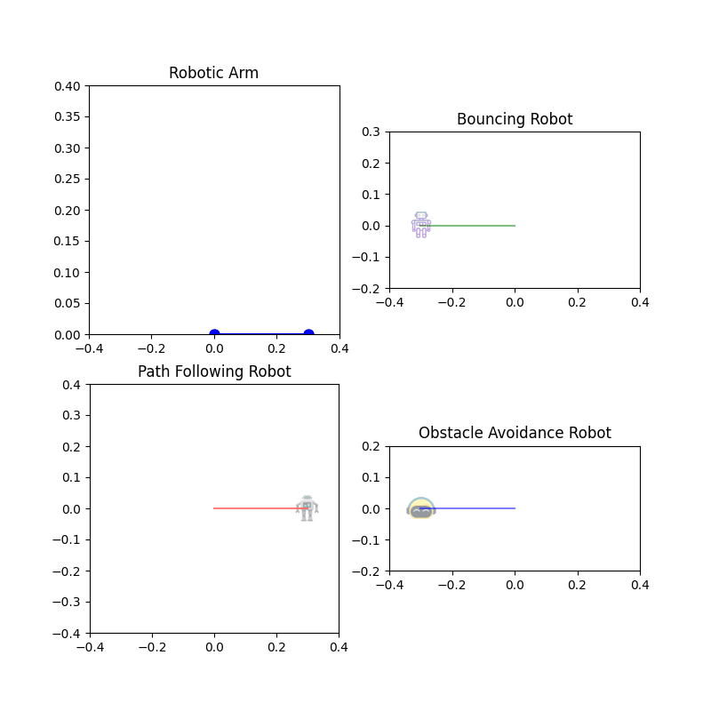

# Robot Simulation with Trails and Dynamic Lighting

This project simulates the behavior of four types of robots using Python and Matplotlib. The simulation includes a robotic arm, a bouncing robot, a path-following robot, and an obstacle-avoidance robot. Each robot's movement is animated, and their paths are visualized with trails. Additionally, dynamic lighting effects are applied based on the robots' positions.


## Table of Contents
1. [Features](#features)
2. [Requirements](#requirements)
3. [Setup](#setup)
4. [Usage](#usage)
5. [Code Overview](#code-overview)
6. [Contributing](#contributing)

## Features
- Robotic Arm: Simulates a robotic arm picking objects in a quarter-circle arc.
- Bouncing Robot: Moves horizontally while bouncing up and down.
- Path-Following Robot: Moves in a circular path.
- Obstacle-Avoidance Robot: Moves in a zigzag pattern to simulate avoiding obstacles.
- Trails: Each robot leaves a trail behind to visualize its path.
- Dynamic Lighting: The robots' transparency changes based on their vertical position.

## Requirements
To run this project, you need the following:
- Python 3.x
- Libraries: `numpy`, `matplotlib`

You can install the required libraries using pip:
```bash
pip install numpy matplotlib
```

## Setup
1. Clone the repository:
   ```bash
   git clone https://github.com/imuser321/robot-motion-simulator.git
   cd robot-motion-simulator
   ```

2. Make sure that the robot icons are placed in the `icons/` directory:
   - `bouncing_robot.png`
   - `path_following_robot.png`
   - `obstacle_avoidance_robot.png`

3. Run the simulation:
   ```bash
   python robot_simulation.py
   ```
## Usage
- The simulation will generate an animation and save it as a GIF file named `robot_simulation_with_trails_and_lighting.gi`.
- The animation will also be displayed in a Matplotlib window.

## Code Overview
### Key Functions

#### 1. Robotic Arm
The robotic arm moves in a quarter-circle arc. Its position is calculated using the following function:
```python
def robotic_arm():
    theta = np.linspace(0, np.pi/2, frames)
    x = 0.3 * np.cos(theta)
    y = 0.3 * np.sin(theta)
    return x, y
```

#### 2. Bouncing Robot
The bouncing robot moves horizontally with a bouncing effect:
```python
def bouncing_robot():
    x = np.linspace(-0.3, 0.3, frames)
    y = 0.2 * np.abs(np.sin(2 * np.pi * np.linspace(0, 1, frames)))  # Bouncing effect
    return x, y
```

#### 3. Path-Following Robot
The path-following robot moves in a circular path:
```python
def path_following_robot():
    t = np.linspace(0, 2 * np.pi, frames)
    x = 0.3 * np.cos(t)
    y = 0.3 * np.sin(t)
    return x, y
```

#### 4. Obstacle-Avoidance Robot
The obstacle-avoidance robot moves in a zigzag pattern:
```python
def obstacle_avoidance_robot():
    x = np.linspace(-0.3, 0.3, frames)
    y = 0.1 * np.sin(5 * np.pi * np.linspace(0, 1, frames))  # Zigzag motion
    return x, y
```

### Animation
The `update()` function updates the positions of the robots and their trails for each frame:
```python
def update(frame):
    # Update trails
    trail_x2[:-1] = trail_x2[1:]
    trail_y2[:-1] = trail_y2[1:]
    trail_x2[-1] = x2[frame]
    trail_y2[-1] = y2[frame]

    trail_x3[:-1] = trail_x3[1:]
    trail_y3[:-1] = trail_y3[1:]
    trail_x3[-1] = x3[frame]
    trail_y3[-1] = y3[frame]

    trail_x4[:-1] = trail_x4[1:]
    trail_y4[:-1] = trail_y4[1:]
    trail_x4[-1] = x4[frame]
    trail_y4[-1] = y4[frame]

    # Update robot positions and trails
    arm.set_data([0, x1[frame]], [0, y1[frame]])
    robot2.set_extent([x2[frame]-0.05, x2[frame]+0.05, y2[frame]-0.05, y2[frame]+0.05])
    robot3.set_extent([x3[frame]-0.05, x3[frame]+0.05, y3[frame]-0.05, y3[frame]+0.05])
    robot4.set_extent([x4[frame]-0.05, x4[frame]+0.05, y4[frame]-0.05, y4[frame]+0.05])

    trail_line2.set_data(trail_x2, trail_y2)
    trail_line3.set_data(trail_x3, trail_y3)
    trail_line4.set_data(trail_x4, trail_y4)

    # Dynamic lighting (adjust alpha based on y-position)
    robot2.set_alpha(0.5 + 0.5 * (y2[frame] / 0.2))  # Bouncing robot
    robot3.set_alpha(0.5 + 0.5 * (y3[frame] / 0.3))  # Path-following robot
    robot4.set_alpha(0.5 + 0.5 * (y4[frame] / 0.1))  # Obstacle-avoidance robot

    return arm, robot2, robot3, robot4, trail_line2, trail_line3, trail_line4
```

### Visualization
The animation is created using Matplotlib's `FuncAnimation`:
```python
# Animate
ani = animation.FuncAnimation(fig, update, frames=frames, interval=50)

# Save animation as GIF
ani.save("robot_simulation_with_trails_and_lighting.gif", writer=animation.PillowWriter(fps=40))

# Display the animation
plt.show()
```
## Contributing
Contributions are welcome! If you'd like to contribute, please follow these steps:
1. Fork the repository.
2. Create a new branch for your feature or bugfix.
3. Commit your changes.
4. Submit a pull request.

## Acknowledgments
- Thanks to Matplotlib for providing excellent tools for creating animations.
- Robot icons are placeholders and can be replaced with custom images.

Enjoy the simulation! If you have any questions or suggestions, feel free to open an issue or contact me.
```